# Both engines on the same models

Generated by `python3 -I scripts/engine_compare.py` (`make engine-comparison`), and checked against a fresh run in CI (`make check-engine-comparison`, T-OUT-05). Do not edit by hand.

**What is compared.** Every kernel model in `examples/` is run by the kernel under RK4, Euler and its `expm` method. Where the projection (ADR 0011) carries the model whole, the reference is the Giannantoni engine's `exp(A t)` at the same step times, so the difference is each kernel method's error against the exact solution. Where it does not, there is no exact solution to compare with: the reference is the kernel's own RK4 at dt/8, and the coverage report's reasons are listed. Both engines' network trajectories are classical (PLAN.md §2 E3), so no difference here is incipient drift. The Giannantoni-format models are shown with the one incipient quantity the engine reports per component, the output-projection drift.

Differences are **scaled**: |Δ| over the node's largest magnitude in the run, maximised over the storages (the Level 1 survey's metric). Below 1e-13 is rounding and is drawn on the floor.

**Reading the plots.** In exponential form RK4 sits near 1e-9 and Euler near 1e-3, and expm is exact to rounding, because it *is* `exp(A t)` for an autonomous linear model. Three things move these orders: a nonlinear law, which expm only linearises per step; forcing, which expm holds fixed across a step; and a jump in a forcing (a `step`, `square` or step-interpolated `table`), which makes every method first order at the jump, so RK4's advantage disappears there. A fast transient the model's dt barely resolves (in the Odum countercurrent models, a price that relaxes in a few steps) puts RK4's largest difference at the start of the run. And a flow through a processing node (interaction, gain, exchange, switch, loop-limited) enters expm as a constant over the step, evaluated at its start (`idc_step_ex` in `src/gssk.c`): where such flows drive the model, expm is first order, and its figure equals Euler's exactly (`atwood_model`, `economic_model`, the `exchange_price_node` models).

## Kernel models

5 of 24 are carried whole and compared with `exp(A t)`.

*Reference error* is how far the reference is from converged: zero for `exp(A t)`, and for RK4 at dt/8 its own difference from RK4 at dt/64. A method's figure is only meaningful where it is well above that.

| Model | Coverage | Reference | Reference error | Own method | RK4 | Euler | expm |
|---|---|---|---|---|---|---|---|
| [`archetype_price_per_instance`](#archetype_price_per_instance) | 25.0% | kernel RK4 at dt/8 | < 1e-13 | rk4 | 1.61e-11 | 1.57e-03 | 1.57e-03 |
| [`atwood_model`](#atwood_model) | 55.6% | kernel RK4 at dt/8 | 3.21e-13 | rk4 | < 1e-13 | 5.00e-03 | 5.00e-03 |
| [`decay_model`](#decay_model) | 100.0% | Giannantoni exp(At) | exact | rk4 | 1.22e-09 | 4.65e-03 | < 1e-13 |
| [`delivered_work_model`](#delivered_work_model) | 61.5% | kernel RK4 at dt/8 | 6.75e-12 | rk4 | 2.87e-08 | 1.32e-02 | 2.16e-03 |
| [`diffusion_model`](#diffusion_model) | 100.0% | Giannantoni exp(At) | exact | rk4 | 2.17e-07 | 1.72e-02 | 1.94e-12 |
| [`economic_model`](#economic_model) | 42.9% | kernel RK4 at dt/8 | 3.11e-12 | rk4 | 1.32e-08 | 6.61e-03 | 6.61e-03 |
| [`emergent_price_model`](#emergent_price_model) | 64.3% | kernel RK4 at dt/8 | 9.77e-13 | rk4 | 4.10e-09 | 9.63e-03 | 1.03e-02 |
| [`exchange_price_node`](#exchange_price_node) | 50.0% | kernel RK4 at dt/8 | < 1e-13 | rk4 | 5.10e-12 | 2.45e-03 | 2.45e-03 |
| [`exchange_price_node_x2`](#exchange_price_node_x2) | 50.0% | kernel RK4 at dt/8 | < 1e-13 | rk4 | 7.99e-11 | 4.78e-03 | 4.78e-03 |
| [`forced_source_model`](#forced_source_model) | 66.7% | kernel RK4 at dt/8 | 6.98e-04 | rk4 | 5.59e-03 | 1.17e-02 | 1.02e-02 |
| [`household_model`](#household_model) | 90.0% | kernel RK4 at dt/8 | 1.37e-12 | rk4 | 5.84e-09 | 1.96e-03 | 1.20e-02 |
| [`household_model_annotated`](#household_model_annotated) | 90.0% | kernel RK4 at dt/8 | 1.37e-12 | rk4 | 5.84e-09 | 1.96e-03 | 1.20e-02 |
| [`interaction_model`](#interaction_model) | 53.3% | kernel RK4 at dt/8 | < 1e-13 | rk4 | 2.10e-12 | 1.00e-03 | 2.50e-03 |
| [`odum_countercurrent`](#odum_countercurrent) | 82.1% | kernel RK4 at dt/8 | 2.79e-05 | rk4 | 1.59e-03 | 1.61e-01 | 1.47e-01 |
| [`odum_countercurrent_annotated`](#odum_countercurrent_annotated) | 82.1% | kernel RK4 at dt/8 | 2.79e-05 | rk4 | 1.59e-03 | 1.61e-01 | 1.47e-01 |
| [`odum_gnp_loop`](#odum_gnp_loop) | 82.8% | kernel RK4 at dt/8 | 2.79e-05 | rk4 | 1.58e-03 | 1.62e-01 | 1.49e-01 |
| [`oscillator_model`](#oscillator_model) | 60.0% | kernel RK4 at dt/8 | 3.25e-11 | rk4 | 1.38e-07 | 1.32e-02 | 1.65e-02 |
| [`price_dynamics_model`](#price_dynamics_model) | 72.2% | kernel RK4 at dt/8 | 1.38e-10 | rk4 | 5.78e-07 | 4.58e-02 | 2.78e-02 |
| [`producer_consumer_model`](#producer_consumer_model) | 28.6% | kernel RK4 at dt/8 | 1.95e-13 | rk4 | 8.66e-10 | 9.55e-03 | 2.12e-02 |
| [`saturation_model`](#saturation_model) | 57.1% | kernel RK4 at dt/8 | 5.93e-11 | rk4 | 2.61e-07 | 1.51e-02 | 5.08e-02 |
| [`simple_model`](#simple_model) | 100.0% | Giannantoni exp(At) | exact | euler | < 1e-13 | < 1e-13 | < 1e-13 |
| [`supply_chain_30`](#supply_chain_30) | 100.0% | Giannantoni exp(At) | exact | rk4 | 2.87e-10 | 2.21e-03 | 1.00e-03 |
| [`tabulated_source_model`](#tabulated_source_model) | 80.0% | kernel RK4 at dt/8 | 6.06e-04 | rk4 | 4.85e-03 | 1.63e-02 | 1.48e-02 |
| [`three_input_gate_model`](#three_input_gate_model) | 100.0% | Giannantoni exp(At) | exact | rk4 | 2.82e-10 | 1.07e-03 | < 1e-13 |

### archetype_price_per_instance

> GIP-0002 regression fixture — an `exchange` inside an archetype trades at a price that belongs to its own instance. One `purchase` template holds a `constant` price member and an `exchange` naming it through params.price_node; two instances, `a` and `b`, are priced independently through snapshot.state on the expanded ids `a__price` (5.0) and `b__price` (12.0). Before the price_node rewrite existed, a template's price_node was discarded at parse time and both instances traded at the template's scalar price instead. INVARIANT: the forward flow k * Q_seller * Q_buyer does not depend on price, so the two inventories are identical at every step while the two money stocks diverge — a__spent / a__inventory == 5.0 and b__spent / b__inventory == 12.0 for the whole run, and buyer + a__spent + b__spent == 1000.0 because money is conserved across both diamonds. POISON VALUES: two distinct regressions are made visible rather than plausible. If the template price_node stops resolving, the exchange falls back to the scalar params.price of 999.0, both instances price identically and the buyer is drained almost immediately. If instead a snapshot.state id stops resolving — which is silent, GSSK_Init skips an unknown id — both prices keep the template's declared 0.0, no money moves at all and the two spent columns stay flat zero while the inventories grow unpriced. Neither failure can be mistaken for this trajectory.

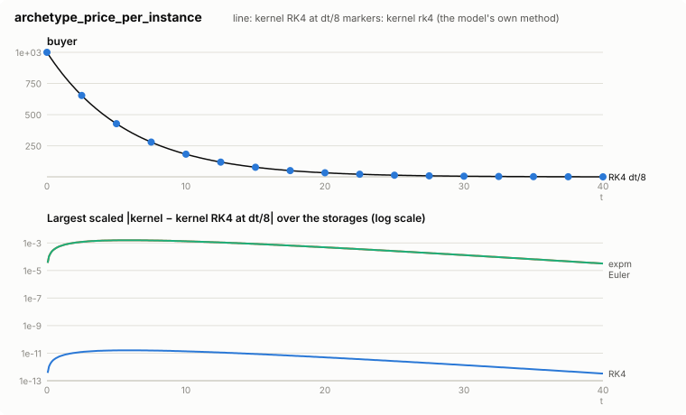

Not compared with the Giannantoni engine: the projection carries 25.0%.
What it cannot carry:

- node 'a': type 'purchase' not carried — a user archetype, which is a composite by another name (ADR 0010)
- node 'b': type 'purchase' not carried — a user archetype, which is a composite by another name (ADR 0010)
- edge 'goods_a': it touches a node that was not carried
- edge 'money_a': it touches a node that was not carried
- edge 'goods_b': it touches a node that was not carried
- edge 'money_b': it touches a node that was not carried

### atwood_model

> Atwood machine dynamics modelled as coupled storage nodes.

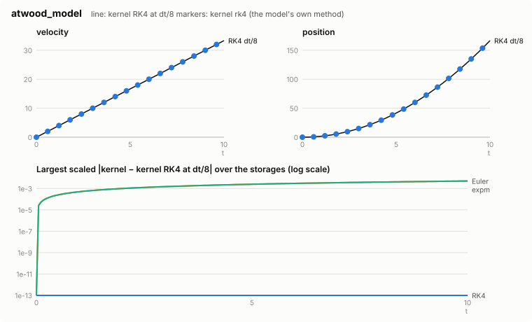

Not compared with the Giannantoni engine: the projection carries 55.6%.
What it cannot carry:

- node 'displacement': 'interaction' carries its law in node params and finds its legs by position; this engine names a module's legs by role (ADR 0013)
- edge 'displacement__feed': it touches a node that was not carried
- edge 'displacement__ctrl': it touches a node that was not carried
- edge 'displacement__out': it touches a node that was not carried

### decay_model

> First-order exponential decay of biomass via linear respiration.

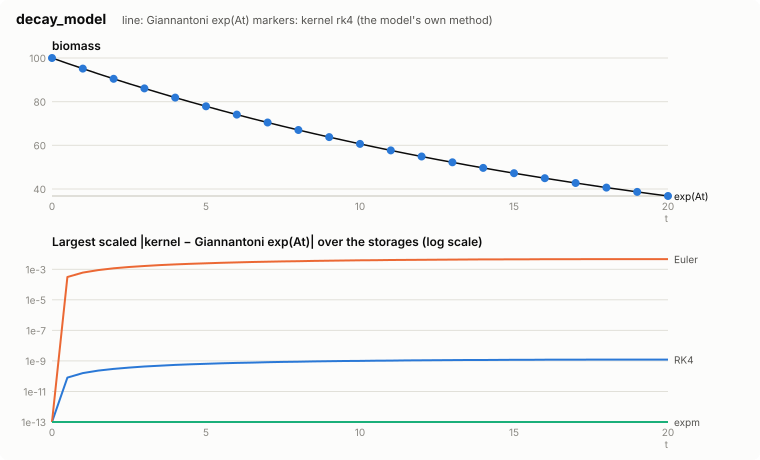

### delivered_work_model

> Phase C.2 — delivered work W as an explicit low-pass state, per ADR 0003. W tracks the real goods flow through the transaction and decays toward it, so it falls when delivery falls. Feeds M/W in C.3. No kernel change: the tap works because compute_derivatives pins sources, constants and processing nodes to dQ/dt = 0, so a parallel edge off a pinned origin costs that origin nothing.

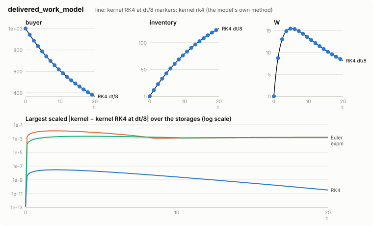

Not compared with the Giannantoni engine: the projection carries 61.5%.
What it cannot carry:

- node 'ex': 'exchange' carries its law in node params and finds its legs by position; this engine names a module's legs by role (ADR 0013)
- edge 'e1': it touches a node that was not carried
- edge 'e2': it touches a node that was not carried
- edge 'e3': it touches a node that was not carried
- edge 'e4': it touches a node that was not carried

### diffusion_model

> GIP-0001 G3 / ADR 0007 — Odum's barb-less pathway. Three tanks in a line, joined by two reversible edges, equilibrating from a step gradient. The declared directions deliberately DISAGREE with the physical one so the example exercises backward transport rather than describing it.

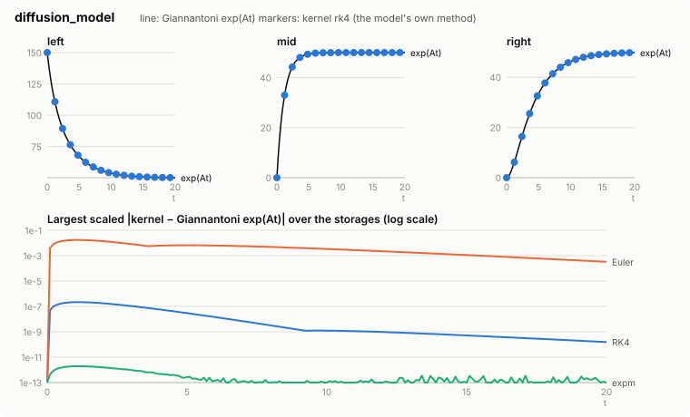

### economic_model

> Supply-demand interaction model with price and inventory dynamics.

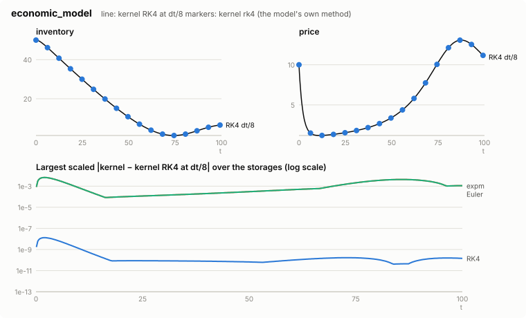

Not compared with the Giannantoni engine: the projection carries 42.9%.
What it cannot carry:

- node 'production': 'interaction' carries its law in node params and finds its legs by position; this engine names a module's legs by role (ADR 0013)
- node 'price_down': 'interaction' carries its law in node params and finds its legs by position; this engine names a module's legs by role (ADR 0013)
- edge 'production__feed': it touches a node that was not carried
- edge 'production__ctrl': it touches a node that was not carried
- edge 'production__out': it touches a node that was not carried
- edge 'price_down__feed': it touches a node that was not carried
- edge 'price_down__ctrl': it touches a node that was not carried
- edge 'price_down__out': it touches a node that was not carried

### emergent_price_model

> Phase C Tier 1 — price as an EMERGENT state variable rather than an authored constant, using only existing logic primitives. Price is a storage node driven by the balance between circulating money and inventory, and is fed back into the transaction diamond through the C.0 price_node hook. No new kernel logic. This is the regression anchor for Tier 2 (C.1-C.4, price = M/W): later work must reproduce or deliberately supersede this trajectory, not silently change it.

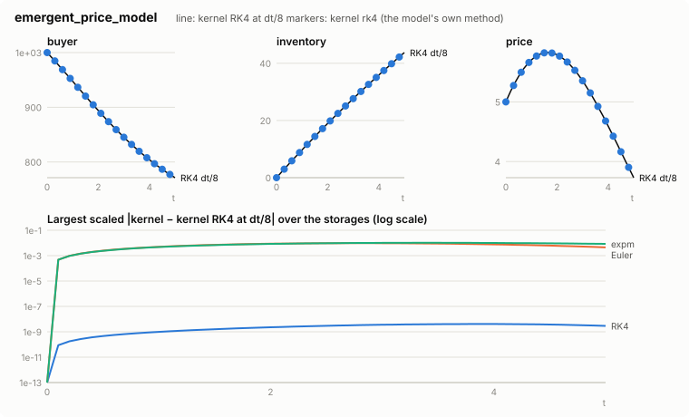

Not compared with the Giannantoni engine: the projection carries 64.3%.
What it cannot carry:

- node 'ex': 'exchange' with an endogenous price resolved from a node — this engine takes a constant exchange ratio (ADR 0001)
- edge 'e1': it touches a node that was not carried
- edge 'e2': it touches a node that was not carried
- edge 'e3': it touches a node that was not carried
- edge 'e4': it touches a node that was not carried

### exchange_price_node

> Phase C.0 — exchange price supplied by a node reference rather than a constant. Equivalence fixture: with the price node held at 5.0 this must reproduce tests/fuzz_corpus/seed_exchange_node.json exactly. The scalar 'price' is set to a poison value of 999.0, so if price_node resolution fails the trajectory diverges obviously instead of subtly. The price node is declared AFTER the exchange node that reads it, exercising second-pass reference resolution.

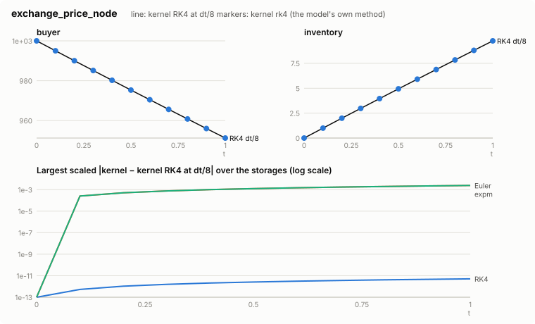

Not compared with the Giannantoni engine: the projection carries 50.0%.
What it cannot carry:

- node 'ex': 'exchange' with an endogenous price resolved from a node — this engine takes a constant exchange ratio (ADR 0001)
- edge 'e1': it touches a node that was not carried
- edge 'e2': it touches a node that was not carried
- edge 'e3': it touches a node that was not carried
- edge 'e4': it touches a node that was not carried

### exchange_price_node_x2

> Phase C.0 — same model as exchange_price_node.json with the price node at 10.0 instead of 5.0, proving the exchange reads the node's value rather than ignoring it. Note the trajectory is NOT simply doubled: the buyer's money stock gates the forward goods flow, so a higher price drains money faster and throttles goods. The invariant that does hold exactly is spent/inventory == price.

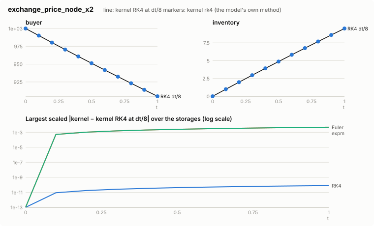

Not compared with the Giannantoni engine: the projection carries 50.0%.
What it cannot carry:

- node 'ex': 'exchange' with an endogenous price resolved from a node — this engine takes a constant exchange ratio (ADR 0001)
- edge 'e1': it touches a node that was not carried
- edge 'e2': it touches a node that was not carried
- edge 'e3': it touches a node that was not carried
- edge 'e4': it touches a node that was not carried

### forced_source_model

> Phase H — Odum's forcing functions (Systems Ecology Fig. 7-2) as ONE waveform vocabulary attached in TWO places. A sinusoidal solar source drives a producer; a square-wave harvest drains it; a step change in the drain's rate arrives partway through the run.

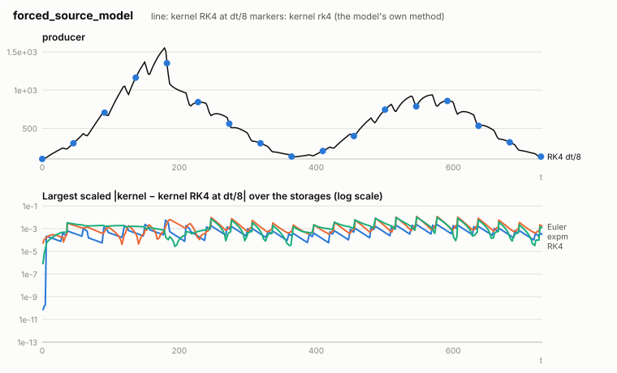

Not compared with the Giannantoni engine: the projection carries 66.7%.
What it cannot carry:

- edge 'cropping': forcing not carried — waveform 'square' is not its own generator, so it cannot be carried as state
- edge 'respiration': forcing not carried — waveform 'step' is not its own generator, so it cannot be carried as state

### household_model

> Multi-carrier household model demonstrating money, energy, material and information flows. Reference example for Phase 5 — all five edge logic types, quality accounting (emergy), and cross-carrier coupling.

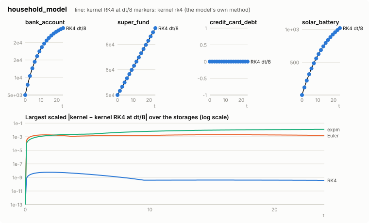

Not compared with the Giannantoni engine: the projection carries 90.0%.
What it cannot carry:

- node 'grocery_exchange': 'exchange' carries its law in node params and finds its legs by position; this engine names a module's legs by role (ADR 0013)
- edge 'grocery_goods_in': it touches a node that was not carried
- edge 'grocery_money_in': it touches a node that was not carried
- edge 'grocery_goods_out': it touches a node that was not carried
- edge 'grocery_money_out': it touches a node that was not carried

Plotted: `bank_account`, `super_fund`, `credit_card_debt`, `solar_battery`. Also in the difference: `grid_credit`, `vehicle_fuel`, `body_energy`, `pantry`, `fridge`, `wardrobe`, `appliances_stock`, `waste_bin`, `household_attention`, `pending_decisions`.

### household_model_annotated

> Multi-carrier household model demonstrating money, energy, material and information flows. Reference example for Phase 5 — all five edge logic types, quality accounting (emergy), and cross-carrier coupling.

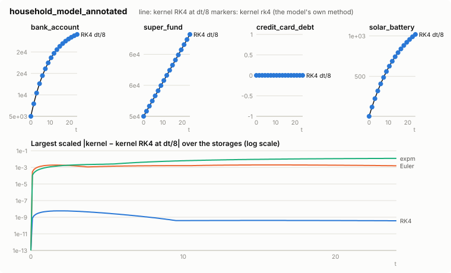

Not compared with the Giannantoni engine: the projection carries 90.0%.
What it cannot carry:

- node 'grocery_exchange': 'exchange' carries its law in node params and finds its legs by position; this engine names a module's legs by role (ADR 0013)
- edge 'grocery_goods_in': it touches a node that was not carried
- edge 'grocery_money_in': it touches a node that was not carried
- edge 'grocery_goods_out': it touches a node that was not carried
- edge 'grocery_money_out': it touches a node that was not carried

Plotted: `bank_account`, `super_fund`, `credit_card_debt`, `solar_battery`. Also in the difference: `grid_credit`, `vehicle_fuel`, `body_energy`, `pantry`, `fridge`, `wardrobe`, `appliances_stock`, `waste_bin`, `household_attention`, `pending_decisions`.

### interaction_model

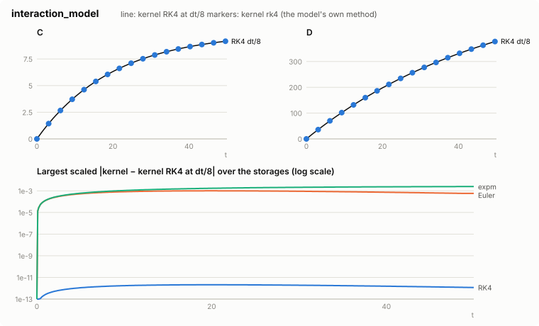

Not compared with the Giannantoni engine: the projection carries 53.3%.
What it cannot carry:

- node 'gate': 'interaction' carries its law in node params and finds its legs by position; this engine names a module's legs by role (ADR 0013)
- node 'converter': 'loop_limited' carries its law in node params and finds its legs by position; this engine names a module's legs by role (ADR 0013)
- edge 'a_to_gate': it touches a node that was not carried
- edge 'b_to_gate': it touches a node that was not carried
- edge 'gate_to_c': it touches a node that was not carried
- edge 'src_to_conv': it touches a node that was not carried
- edge 'conv_to_d': it touches a node that was not carried

### odum_countercurrent

> Phase C.4 — inflation emerges from net-energy decline. Odum's Figure-2 structure: getting energy costs energy, fed back from the structure, and the fuel resource is a depleting storage. As fuel depletes the feedback fraction rises, net energy falls, and price rises. Odum (1973) 'Energy, Ecology and Economics', points 1-3.

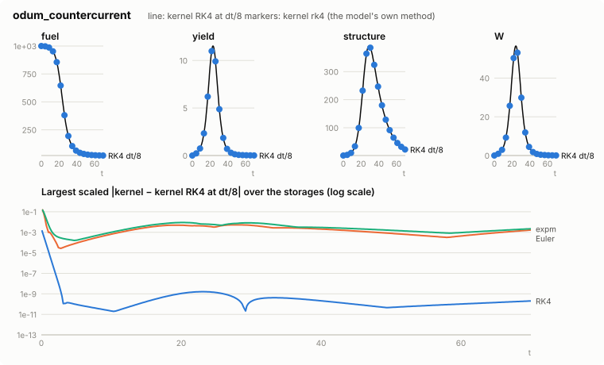

Not compared with the Giannantoni engine: the projection carries 82.1%.
What it cannot carry:

- node 'ex': 'exchange' with an endogenous price resolved from a node — this engine takes a constant exchange ratio (ADR 0001)
- edge 'supply': it touches a node that was not carried
- edge 'payment': it touches a node that was not carried
- edge 'sold': it touches a node that was not carried
- edge 'revenue': it touches a node that was not carried

Plotted: `fuel`, `yield`, `structure`, `W`. Also in the difference: `W_gross`, `price`.

### odum_countercurrent_annotated

> Phase C.4 — inflation emerges from net-energy decline. Odum's Figure-2 structure: getting energy costs energy, fed back from the structure, and the fuel resource is a depleting storage. As fuel depletes the feedback fraction rises, net energy falls, and price rises. Odum (1973) 'Energy, Ecology and Economics', points 1-3.

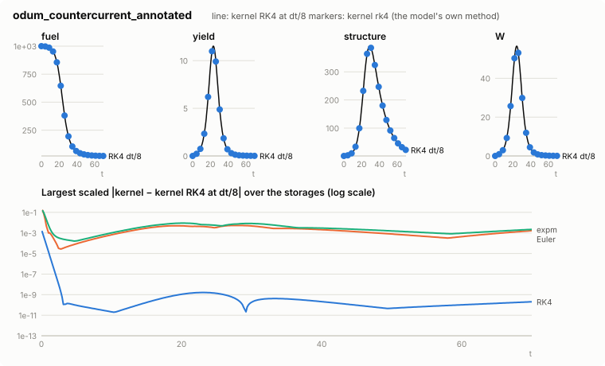

Not compared with the Giannantoni engine: the projection carries 82.1%.
What it cannot carry:

- node 'ex': 'exchange' with an endogenous price resolved from a node — this engine takes a constant exchange ratio (ADR 0001)
- edge 'supply': it touches a node that was not carried
- edge 'payment': it touches a node that was not carried
- edge 'sold': it touches a node that was not carried
- edge 'revenue': it touches a node that was not carried

Plotted: `fuel`, `yield`, `structure`, `W`. Also in the difference: `W_gross`, `price`.

### odum_gnp_loop

> Phase D.1 — money as a closed, conserved GNP loop (Odum Fig. 3). The C.4 countercurrent drained money one way into a sink, so the 'conserved: true' declaration on the money carrier asserted nothing: conservation is measured over STORAGE nodes only, and a source/sink pair contributes none. Here money circulates households -> exchange -> firms -> households with no money source and no money sink, so the total is a real invariant the solver must hold. Energy over the same run is NOT conserved — it dissipates to heat and to the consumed sink — which is the asymmetry Odum draws: energy flows through, money goes round.

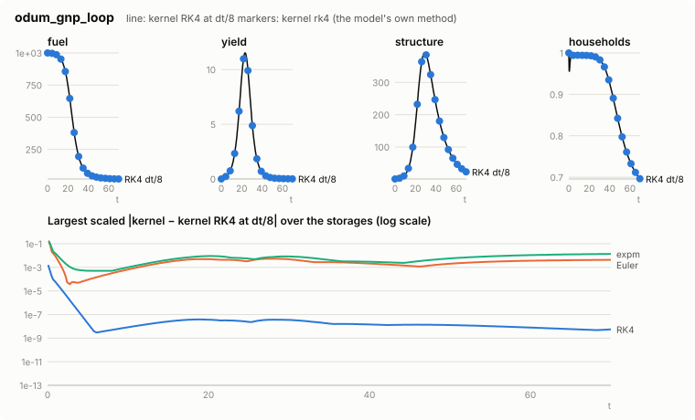

Not compared with the Giannantoni engine: the projection carries 82.8%.
What it cannot carry:

- node 'ex': 'exchange' with an endogenous price resolved from a node — this engine takes a constant exchange ratio (ADR 0001)
- edge 'supply': it touches a node that was not carried
- edge 'payment': it touches a node that was not carried
- edge 'sold': it touches a node that was not carried
- edge 'revenue': it touches a node that was not carried

Plotted: `fuel`, `yield`, `structure`, `households`. Also in the difference: `firms`, `W`, `W_gross`, `price`.

### oscillator_model

> Lotka-Volterra predator-prey oscillator using interaction edges.

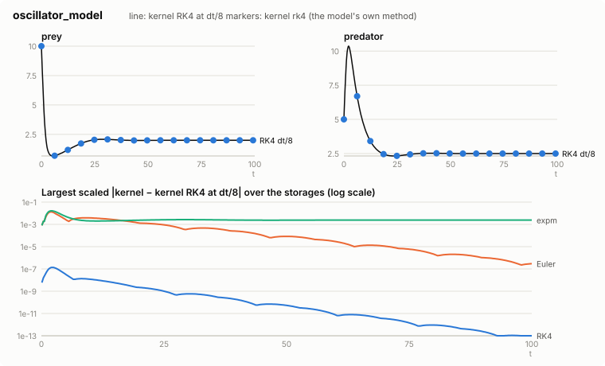

Not compared with the Giannantoni engine: the projection carries 60.0%.
What it cannot carry:

- node 'consumption': 'interaction' carries its law in node params and finds its legs by position; this engine names a module's legs by role (ADR 0013)
- edge 'consumption__feed': it touches a node that was not carried
- edge 'consumption__ctrl': it touches a node that was not carried
- edge 'consumption__out': it touches a node that was not carried

### price_dynamics_model

> Phase C.3 — price as a state relaxing toward Odum's ratio: dP/dt = alpha x (M/W - P). M is circulating money, W is delivered work (the C.2 low-pass tap), and the quotient is the C.1 ratio primitive with both operands named. Companion to emergent_price_model.json, which reaches a quantity PROPORTIONAL to M/W as the fixed point of two hand-tuned coefficients; this model computes the ratio itself. Both are kept so the difference stays visible in the suite.

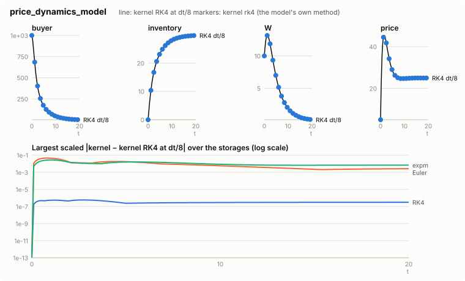

Not compared with the Giannantoni engine: the projection carries 72.2%.
What it cannot carry:

- node 'ex': 'exchange' with an endogenous price resolved from a node — this engine takes a constant exchange ratio (ADR 0001)
- edge 'e1': it touches a node that was not carried
- edge 'e2': it touches a node that was not carried
- edge 'e3': it touches a node that was not carried
- edge 'e4': it touches a node that was not carried

### producer_consumer_model

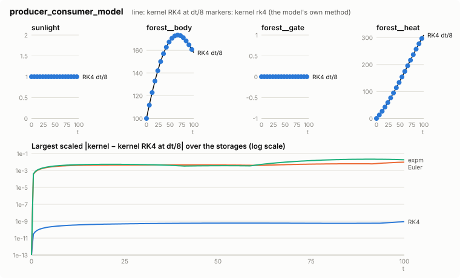

Not compared with the Giannantoni engine: the projection carries 28.6%.
What it cannot carry:

- node 'forest': type 'producer' not carried — a built-in composite; composites are not expanded (ADR 0010)
- node 'deer': type 'consumer' not carried — a built-in composite; composites are not expanded (ADR 0010)
- edge 'solar_input': it touches a node that was not carried
- edge 'grazing': it touches a node that was not carried
- edge 'deer_waste': it touches a node that was not carried

Plotted: `sunlight`, `forest__body`, `forest__gate`, `forest__heat`. Also in the difference: `deer__body`, `deer__heat`, `heat_env`.

### saturation_model

> Michaelis-Menten saturation (limit logic) — enzyme kinetics example.

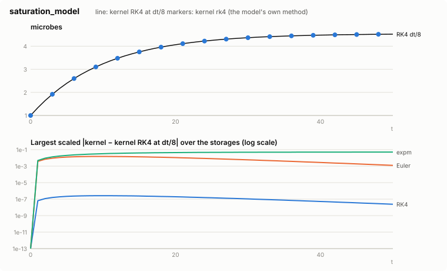

Not compared with the Giannantoni engine: the projection carries 57.1%.
What it cannot carry:

- node 'uptake': 'loop_limited' carries its law in node params and finds its legs by position; this engine names a module's legs by role (ADR 0013)
- edge 'uptake__feed': it touches a node that was not carried
- edge 'uptake__out': it touches a node that was not carried

### simple_model

> Minimal linear flow from a source into a storage node.

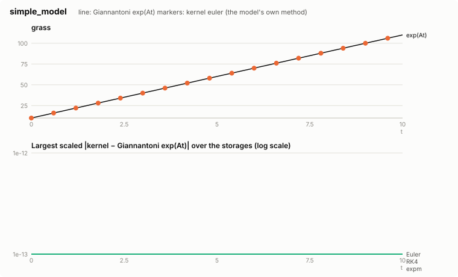

### supply_chain_30

> 30-node supply chain benchmark network for performance testing.

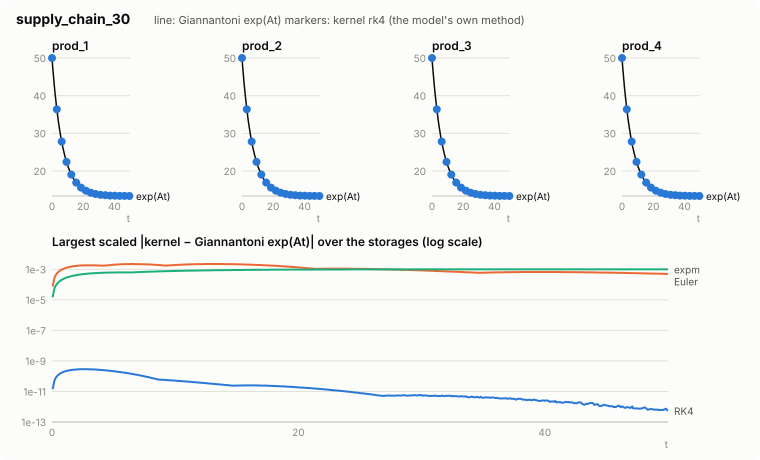

Plotted: `prod_1`, `prod_2`, `prod_3`, `prod_4`. Also in the difference: `prod_5`, `proc_1`, `proc_2`, `proc_3`, `proc_4`, `proc_5`, `dist_1`, `dist_2`, `dist_3`, `dist_4`, `dist_5`, `retail_1`, `retail_2`, `retail_3`, `retail_4`, `retail_5`, `cons_1`, `cons_2`, `cons_3`, `cons_4`, `recy_1`, `recy_2`, `recy_3`, `recy_4`.

### tabulated_source_model

> h8c: a source driven by a data series rather than a formula, the role READ/DATA plays in Odum's BASIC listings. Twelve monthly insolation values drive a producer, and the series repeats every year. The values are illustrative, chosen to show the mechanism, and are not measurements.

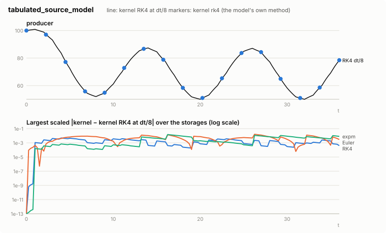

Not compared with the Giannantoni engine: the projection carries 80.0%.
What it cannot carry:

- node 'sun': forcing not carried — waveform 'table' is not its own generator, so it cannot be carried as state

### three_input_gate_model

> GIP-0001 G1 / ADR 0008 — the rest of Odum's overloaded interaction glyph. One three-input work gate (Modeling for All Scales, Fig. 2.6c) driving production, and one subtracting action (Fig. 2.6e) draining maintenance respiration. Both forms in one model, because both are edge arity/logic changes to the same primitive.

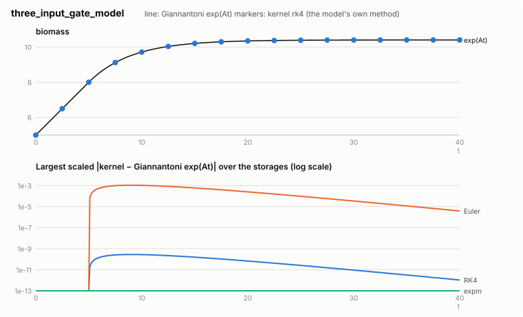

## Giannantoni-format models

These are in the engine's own format (`examples/giannantoni/`), which the kernel does not read, so the comparison here is within the engine: the classical network trajectory beside the incipient output-projection drift. Run with `--steps 100`.

| Model | Component | Q(0) | Q(t_end) | max \|drift\| |
|---|---|---:|---:|---:|
| `closed_loop` | `source_1` | 2 | 2 | 0 |
| `closed_loop` | `interaction_1` | 0 | 0 | 0 |
| `closed_loop` | `store_1` | 10 | 10.2 | 1.12e-03 |
| `closed_loop` | `consumer_1` | 0 | 4.56 | 3.72e-02 |
| `closed_loop` | `recycler_1` | 0 | 1.36 | 2.23e-04 |
| `closed_loop` | `heat_1` | 0 | 0.706 | 0 |
| `coproduction` | `sun` | 2 | 2 | 0 |
| `coproduction` | `soil` | 4 | 3.83 | 1.42e-05 |
| `coproduction` | `nutrients` | 2 | 1.68 | 1.35e-06 |
| `coproduction` | `growth` | 0 | 0 | 0 |
| `coproduction` | `wood` | 1 | 1.54 | 2.57e-05 |
| `coproduction` | `seeds` | 0.2 | 0.736 | 9.77e-05 |
| `coproduction` | `heat` | 0 | 0.322 | 0 |
| `harmonic_couples` | `sun` | 1 | 1 | 0 |
| `harmonic_couples` | `a` | 2 | 2.18 | 3.00e-06 |
| `harmonic_couples` | `b` | 1 | 1.2 | 2.00e-06 |
| `harmonic_couples` | `c` | 1 | 1.02 | 2.00e-06 |
| `input` | `source_1` | 2 | 2 | 0 |
| `input` | `interaction_1` | 0 | 0 | 0 |
| `input` | `store_1` | 10 | 12.1 | 1.25e-03 |
| `input` | `consumer_1` | 0 | 6.21 | 3.73e-02 |
| `input` | `heat_1` | 0 | 0.929 | 0 |
| `trophic_chain` | `sun` | 2 | 2 | 0 |
| `trophic_chain` | `producer` | 5 | 4.25 | 2.00e-05 |
| `trophic_chain` | `herbivore` | 1 | 2.32 | 1.90e-04 |
| `trophic_chain` | `decomposer` | 0.5 | 1.36 | 1.15e-04 |
| `trophic_chain` | `heat` | 0 | 0.572 | 0 |

### closed_loop

closed_loop.

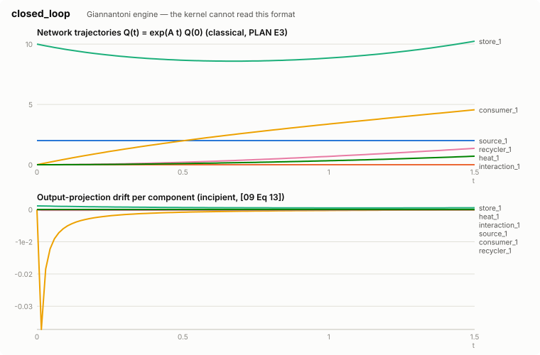

### coproduction

coproduction.

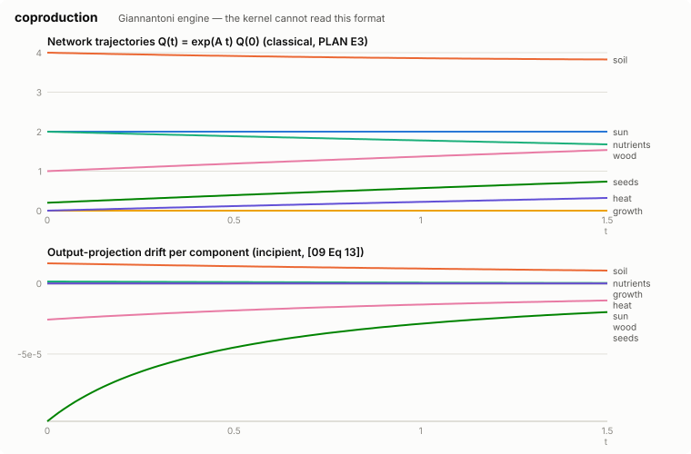

### harmonic_couples

harmonic_couples.

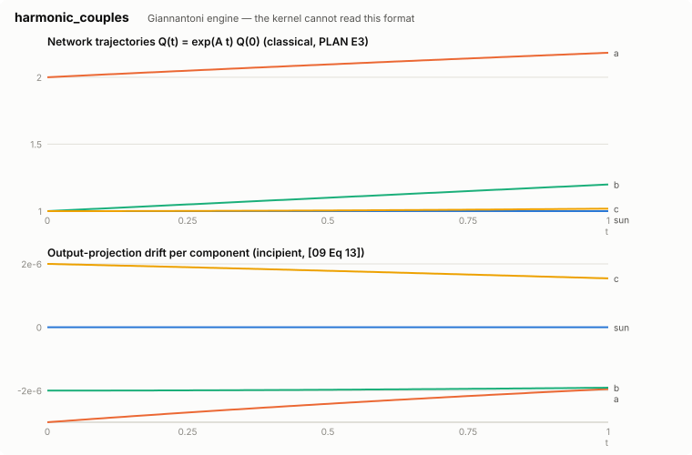

### input

input.

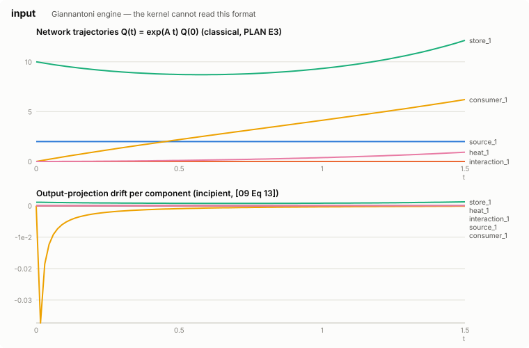

### trophic_chain

trophic_chain.

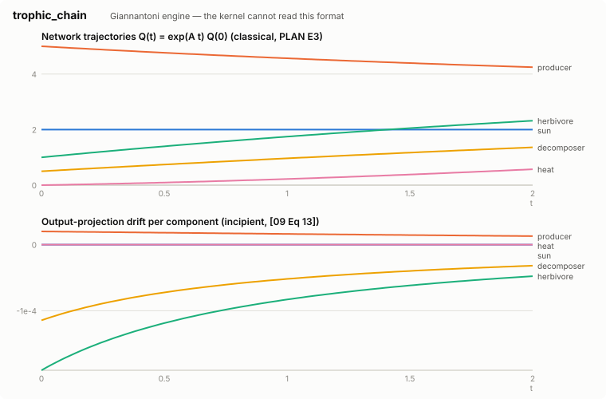

